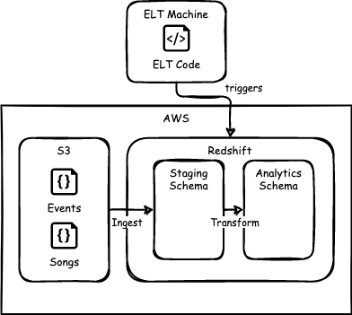
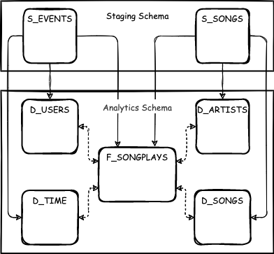

# Sparkify ELT on AWS Redshift for Analytics at Scale

This application processes data for the fictional Sparkify music streaming startup to support analytics use cases.

To support their analytical use cases at scale, this repository contains code to **provision an AWS Redshift** cluster as the target data warehouse. The data pipeline **ingests data from JSON files in S3** into staging tables on Redshift before **transforming it into a dimensional model** for analytics. The pattern resembles **ELT**, since the data is transformed within the target location.

The data is modeled in a star schema to allow create queries on customer interactions (songplays). For example, the number of songs played by specific specific users or artists may be directly queried from the `f_songplays` *fact* table. The queries then may be enriched by joining data from the *dimension* tables `d_users`, `d_songs`, `d_artists` and `d_time`, for example by filtering by the day of week.

## Data Pipeline

- **E**xtract: Not in scope of this project
- **L**oad: Loads raw data from JSON files in S3 to Redshift `staging` schema
- **T**ransform: Transforms staging data into dimensional model in `analytics` schema



## Data Model

The data model is separated into the following schemas:
- `staging` schema for storing raw data loaded from S3
- `analytics` schema for supporting queries for analytics
- `d_artists` and `d_songs` originate from `s_songs`
- `d_users` and `d_time` originate from `s_events`
- `f_songplays` originates from both `s_events` and `s_songs`



## Installation

Install the Python package and its dependencies from source via `poetry`.
```bash
poetry install
```

FYI from `poetry install --help`:
> DESCRIPTION  
  The install command reads the poetry.lock file from  
  the current directory, processes it, and downloads and installs all the  
  libraries and dependencies outlined in that file. If the file does not  
  exist it will look for pyproject.toml and do the same.

## Usage

### Provision AWS Infrastructure

1. Create a user with privileges for creating `Redshift`, `IAM` and `VPC` resources.
2. Provide your AWS information and secrets in the `redshift.cfg`
3. Provision infrastructure on AWS by following steps in `./notebooks/boto3.ipynb`

### Run Data Pipeline

1. Verify that the cluster has status `available`.
2. Create schemas and tables

```
$ poetry run python aws_redshift_etl/create_tables.py --help 

usage: create_tables.py [-h] [--no-verbose] [--config CONFIG] [--skip-staging]

optional arguments:
  -h, --help       show this help message and exit
  --no-verbose     Enables verbose logging behaviour
  --config CONFIG  Filepath to config file
  --skip-staging   If given, do not drop staging tables
```

2. Load staging data and transform into final schema

```
$ poetry run python aws_redshift_etl/etl.py --help

usage: etl.py [-h] [--verbose] [--config CONFIG] [--skip-staging]

optional arguments:
  -h, --help       show this help message and exit
  --verbose        Enables verbose logging behaviour
  --config CONFIG  Filepath to config file
  --skip-staging   If given, do not load any staging data
```
